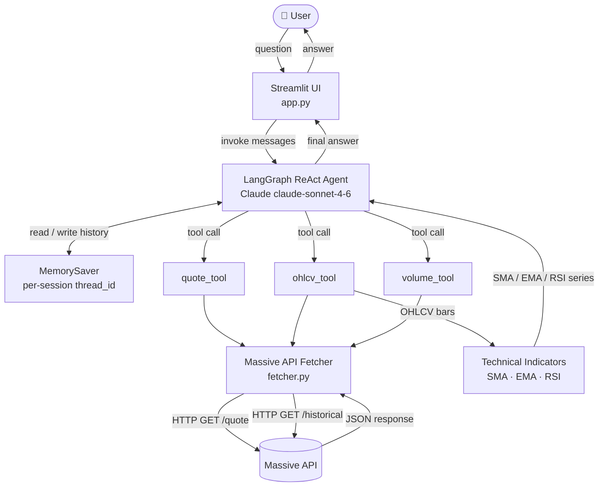

# Market Analysis AI Agent

An agentic AI that answers stock market questions in plain English. Powered by Claude (Anthropic) and the Massive API, it fetches real-time quotes, historical OHLCV data, and computes technical indicators — all through a conversational Streamlit interface.

---

## Features

- **Conversational chat UI** — ask questions naturally, get answers with context
- **Real-time quotes** — current price, bid/ask, intraday change and volume
- **Historical OHLCV data** — daily bars for any lookback period
- **Technical indicators** — SMA, EMA, RSI computed with pandas
- **Multi-turn memory** — the agent remembers earlier questions within a session
- **ReAct agent loop** — Claude reasons step-by-step and decides which tools to call

---

## Stack

| Layer | Technology |
|---|---|
| LLM | Anthropic Claude (claude-sonnet-4-6) |
| Agent framework | LangGraph (prebuilt ReAct agent) |
| Market data | Massive API |
| Indicators | pandas |
| UI | Streamlit |
| Language | Python 3.11+ |

---

## Project Structure

```
market-agent/
├── app.py                  # Streamlit entry point
├── requirements.txt
├── .env.example            # Environment variable template
├── src/
│   ├── data/
│   │   ├── fetcher.py      # Massive API: get_quote, get_ohlcv, get_volume
│   │   └── indicators.py   # SMA, EMA, RSI
│   ├── tools/
│   │   └── market_tools.py # LangChain tool definitions (quote, ohlcv, volume)
│   └── agent/
│       ├── agent.py        # build_agent() — LangGraph ReAct loop
│       └── memory.py       # MemorySaver for per-session conversation history
└── tests/
    └── test_fetcher.py     # Unit tests for the data fetcher
```

---

## Setup

### 1. Clone the repo

```bash
git clone https://github.com/kovvurisupraj/market-agent.git
cd market-agent
```

### 2. Create a virtual environment

```bash
python -m venv .venv
```

### 3. Install dependencies

```bash
# Windows
.venv\Scripts\pip install -r requirements.txt

# macOS / Linux
.venv/bin/pip install -r requirements.txt
```

### 4. Configure environment variables

```bash
copy .env.example .env      # Windows
cp .env.example .env        # macOS / Linux
```

Open `.env` and fill in your keys:

```
MASSIVE_API_KEY=your_massive_api_key_here
ANTHROPIC_API_KEY=your_anthropic_api_key_here
```

- Get a Massive API key at [massiveapi.com](https://massiveapi.com)
- Get an Anthropic API key at [console.anthropic.com](https://console.anthropic.com)

---

## Running the App

```bash
# Windows
.venv\Scripts\streamlit.exe run app.py

# macOS / Linux
.venv/bin/streamlit run app.py
```

The app opens at `http://localhost:8501`.

---

## Example Questions

```
What is AAPL trading at right now?
Show me Tesla's price history for the last 30 days.
What is the 14-day RSI for MSFT?
Compare the 20-day SMA and EMA for NVDA.
What was the trading volume for AMZN today?
```

---

## Running Tests

```bash
# Windows
.venv\Scripts\python -m pytest tests/ -v

# macOS / Linux
.venv/bin/python -m pytest tests/ -v
```

All HTTP calls are mocked — no API key or network connection required to run the test suite.

---

## Architecture



The agent receives the user's question, decides which tool(s) to call, observes the results, and reasons until it has enough information to produce a final answer. Conversation history is preserved per browser session using LangGraph's `MemorySaver`.

---

## Environment Variables

| Variable | Description |
|---|---|
| `MASSIVE_API_KEY` | API key for the Massive market data API |
| `ANTHROPIC_API_KEY` | API key for Anthropic Claude |

Never commit your `.env` file. It is listed in `.gitignore`.
